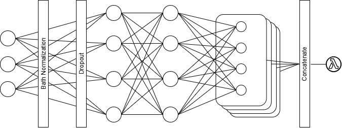

## Setup

Install requirements

```
pip install -r requirements.txt
```

To use keras_tuner with tensorflow_probability and tf_keras, copy `assets/config.py` to `keras_tuner/src/backend` in your environment's `python3.*/dist-packages`

## Models

Two parametric models are available for estimating conditional mean and variance of log returns. Additionally, a "distributional neural network" is available for estimating location, scale, and shape parameters of a conditional distribution.

### HAR
`har.py` contains functions to estimate a HAR-RV model under various distributional assumptions. See example usage in `eval.ipynb`

### ARMA-GARCH
`models.arma_garch` provides a class for estimating ARMA(m,n)-GARCH(p,q) models. See example usage in `eval_arma_garch.py`

`models.simple` provides a simpler, quicker implementation for AR(1)-GARCH(1,1) models. See example usage in `eval.ipynb`


### Neural Network 
`models.nn` adapts code from [Marcjasz et al. (2022)](
https://doi.org/10.48550/arXiv.2207.02832) to implement a neural network for density estimation. Input data is optionally passed to batch normalization and dropout layers then two fully connected hidden layers. Outputs from the second hidden layer are passed to a separate hidden layer for each parameter in the specified distribution. Outputs from the distribution parameter hidden layers are concatenated and passed to the distribution layer which outputs a TensorFlow distribution. See the [TensorFlow documentation](https://www.tensorflow.org/probability/api_docs/python/tfp/distributions) for details on usage of distribution classes.



The model is constructed by passing a Keras Hyperparameters object and a distribution type to the function `build_model()`. Hyperparameter values can be selected using keras_tuner. See example in `nn.ipynb`

## Distributions

Distributions for parametric models are implemented as classes in `dist.py`. The inputs to these distributions are assumed to be standardized residuals, so the above described parametric models must apply the transformation:  

$$
f(r_t;\mu_t, \sigma_t, \eta) = \frac{1}{\sigma_t}f\left (\frac{r_t - \mu_t}{\sigma_t}; \eta \right)
$$  

Each distribution defines a density function `.pdf()`, quantile function `.ppf()`, and log-likelihood function `.llh()`. All distribution classes inherit the method `.crps()` which calculates the Continuous Ranked Probability Score using the integral of the Quantile Score from 0 to 1 ([Gneiting and Ranjan 2011](https://www.jstor.org/stable/23243806)).
$$
\begin{aligned}
\text{CRPS}(f,y) & = \int^{\infty}_{-\infty}(F(z) - \mathbb{I}[y \le z])^2dz \\
 & = 2\int^1_0 (\mathbb{I}[y \le F^{-1}(\alpha)] - \alpha)(F^{-1}(\alpha) - y)d\alpha   
\end{aligned}
$$

### Symmetric distributions

`dist.Normal`, `dist.Laplace`, `dist.StudentT` use density and quantile functions from distributions imported from `scipy.stats`. The `.llh()` methods call jit-compiled log-likelihood functions for faster MLE estimation.

### Skewed distributions

`dist.CondSNorm`, `dist.CondSLap`, `dist.CondST` add skewness to the corresponding symmetric distribution using [Wurtz et al. (2006)](https://api.semanticscholar.org/CorpusID:17916711) reparametrization of [Fernandez and Steel (1998)](https://doi.org/10.2307/2669632).

$$
\begin{align*}
& f(z_t;\xi,\eta) = \frac{2\sigma_\xi}{\xi + \frac{1}{\xi}}f(z_{\xi t};\eta) \\ 
& z_{\xi t} = \xi^{sgn(\sigma_{\xi}z_t + \mu_{\xi})}(\sigma_{\xi}z_t + \mu_{\xi})  \\
& \mu_{\xi} = \text{M}_1(\xi - \frac{1}{\xi})  \\
& \sigma_{\xi} = (1 - \text{M}_1^2)(\xi^2 + \frac{1}{\xi^2}) + 2\text{M}_1^2 - 1  \\
\end{align*}
$$

`dist.CondJsu` uses density and quantile functions adapted from the R package `rugarch` rather than equivalent methods from `scipy.stats`. A jit-compiled log-likelihood function has not been implemented for this distribution, but is intended to be added in the future. Instead, `.llh()` sums the log of the values returned by its `.pdf()` method.
$$
    f(z_t;\xi,\lambda,\gamma,\delta) = 
    \frac{\delta}{\lambda\sqrt{1 + \Big(\frac{z_t - \xi}{\lambda}\Big)^2}} 
    \cdot \phi\left[\gamma+\delta\sinh^{-1}\Big(\frac{z_t-\xi}{\lambda}\Big)\right]
$$

$$
\begin{aligned}
    & \xi = -\lambda\omega^{\frac{1}{2}}\sinh\Omega \quad\quad
    \lambda = \left[ \frac{1}{2}(\omega - 1)(\omega\cosh2\Omega + 1) \right]^{-\frac{1}{2}}  \\
    & \omega = \exp(\delta^{-2}) \quad\quad 
    \Omega = \frac{\gamma}{\delta} \\
\end{aligned}
$$
<br>

## Future Development
1. #### Refactor HAR into model class
2. #### Create a class to be returned from model fit storing residuals, params, llh, and distribution which provides methods for model evaluation
    - Standard errors  
    - Significance
    - Ljung-Box and Breusch-Godfrey tests
    - ARCH-LM test
    - Jarque-Bera or Kolmogorov-Smirnov tests
    - AIC and BIC

3. #### Evaluate against results from other packages for obvious discrepancies

4. #### Implement a "brute-force" approach to GARCH and HAR with time varying shape
    - Create a method which calls a new model fit at each forecast step
    - Provide option to choose parameters to hold constant

5. #### Implement conditional skew/kurtosis  
    - GARCH references:
        - Hansen 1994  
        - Harvey and Siddique 1999  
        - Jondeau and Rockinger 2003  
        - Leon et al. 2005  
    - HAR references:
        - Amaya et al. 2013
        - Mei et al. 2016

---

#### Implement additional models  
- HEAVY
- Other GARCH family models
- Other HAR family models
- Other Neural network architectures (beneath param/distribution layers)
    - Kim and Won 2018
    - Benitez et al 2021
    - Barunik et al 2024

#### Implement VaR and expected shortfall from estimated densities